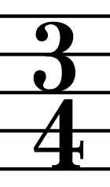
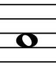
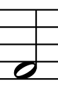
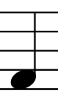
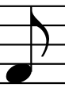
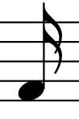
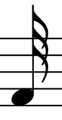

# DDD Koans

This project contains source for the **DDD Koans** course on Stepik.

## Domain overview

In this course, we would like to focus on the domain of music. Specifically speaking, on music creation.
 
* How musician creates new songs?
* What is needed to achieve it?
* What is the song lifecycle?
* How collaboration looks like?
* and many more...

## Theoretical background

This section describes a simplified music theory terms. 

### Time signatures

Time signatures are symbols which describe repeating beat rhythm in a piece of music.

They consist of two numbers: 
 * The upper number is the count of beats in the meter - **3** in the above example.  
 * The lower number is the symbol length used to represent each beat - **4** in the above example.
 
Together they tell us the total length of all symbols in a bar.

In text time signatures are written using slash sign **/** like **3/4**.

#### The upper number

The upper number has one limitation - it needs to be greater than 0 integer.
However, for purpose of this example let's say that maximum number can be equal to **32**.

#### The lower number

The lower number always corresponds to the beat unit which is a value of music note.

Available values are (limited for the purpose of course):

|Note symbol|Name|Written in text as|Beat unit value in time signature|
|---|---|---|---|
||whole note|**1/1**|1|
||half note|**1/2**|2|
||quarter note|**1/4**|4|
||eight note|**1/8**|8|
||sixteenth note|**1/16**|16|
||thirty second note|**1/32**|32|

Mathematically speaking one whole note (**1/1**) is equivalent to two half notes (**1/2**)(**1/1** == 2***1/2**). 
Same rule applies for the rest of values.

